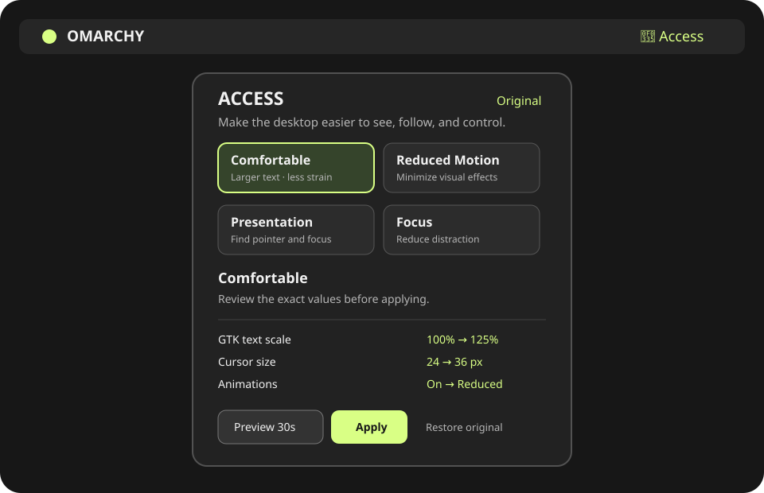

# Access Profiles for Omarchy

Make Omarchy easier to see, follow, and control with one-click accessibility
profiles that are always safe to undo.

Access Profiles is a local-only Quickshell plugin for Omarchy 4.x. It groups
carefully scoped Hyprland and GTK settings into four explainable profiles:
Comfortable, Reduced Motion, Presentation, and Focus. Every preview and apply
is read back, state is kept outside the checkout, and restore detects changes
made by another tool before touching them.



## Install

Plugins run as unsandboxed code inside `omarchy-shell`; inspect this repository
before enabling it.

```sh
omarchy plugin add https://github.com/EF-Code/omarchy-access-profiles.git --enable
omarchy bar move io.github.ef-code.access-profiles --section right
```

Open the Access icon, select a profile, review the plan, and choose **Preview
30s** or **Apply**. Preview has explicit **Keep** and **Revert now** actions.
The first preview or apply captures the original baseline exactly once.

## Restore before removal

Always choose **Restore Original** and resolve any conflicts before removing
the plugin. Omarchy plugins have no uninstall hook, so removal cannot restore
settings automatically.

```sh
omarchy plugin remove io.github.ef-code.access-profiles
```

If the panel is unavailable while the checkout still exists, run:

```sh
~/.config/omarchy/plugins/io.github.ef-code.access-profiles/scripts/accessctl restore
```

The baseline is stored at
`${XDG_STATE_HOME:-$HOME/.local/state}/omarchy-access-profiles/baseline.json`.
The helper refuses unsafe XDG paths and state-file symlinks. Manual recovery
should be performed only after inspecting that file and the live values.

## Supported settings

| Setting | Surface | Timing |
| --- | --- | --- |
| Hyprland animations, blur, shadows, dimming, borders | Hyprland session | Immediate |
| Cursor zoom | Hyprland compositor | Immediate |
| Keyboard repeat rate and delay | Hyprland input | Immediate |
| GTK animation preference, text scale, cursor size | GTK applications honoring the schema | Immediate or new app |

Support is probed at runtime. `Supported`, `App-dependent`, `Unavailable`,
and `Error` are shown separately; unsupported optional settings do not make a
profile pretend to be complete. Monitor scaling and screen-reader support are
intentionally out of scope.

## Privacy and security

The plugin has no network dependency, account, telemetry, or privileged path.
QML invokes one local helper with the user’s permissions. Profile data can
contain only registered setting IDs and typed bounded values; it cannot carry
commands or configuration paths. The helper uses argument arrays, a short
`flock`, atomic state writes, a pending-operation journal, verified rollback,
and a bounded local history. Diagnostics omit usernames, home paths, window
titles, command history, and application content.

GTK settings do not affect every Qt, Electron, browser, or already-running
application. Cursor behavior varies by toolkit. Profiles leave omitted
settings alone. Hardware, geometry, focus, and multi-monitor behavior must be
validated on the target Omarchy session; static checks do not prove those
paths.

## Development

```sh
omarchy plugin validate .
qmllint -I "${OMARCHY_PATH:-/usr/share/omarchy}/shell" \
  BarWidget.qml Panel.qml Service.qml components/*.qml
bash tests/run.sh
node tests/model.test.js
bash tests/repository-check.sh
```

For a safe backend-only run, set `ACCESSCTL_MOCK_DIR` to an absolute temporary
directory. The mock adapter never changes the live desktop.

## License

MIT. See [LICENSE](LICENSE).
